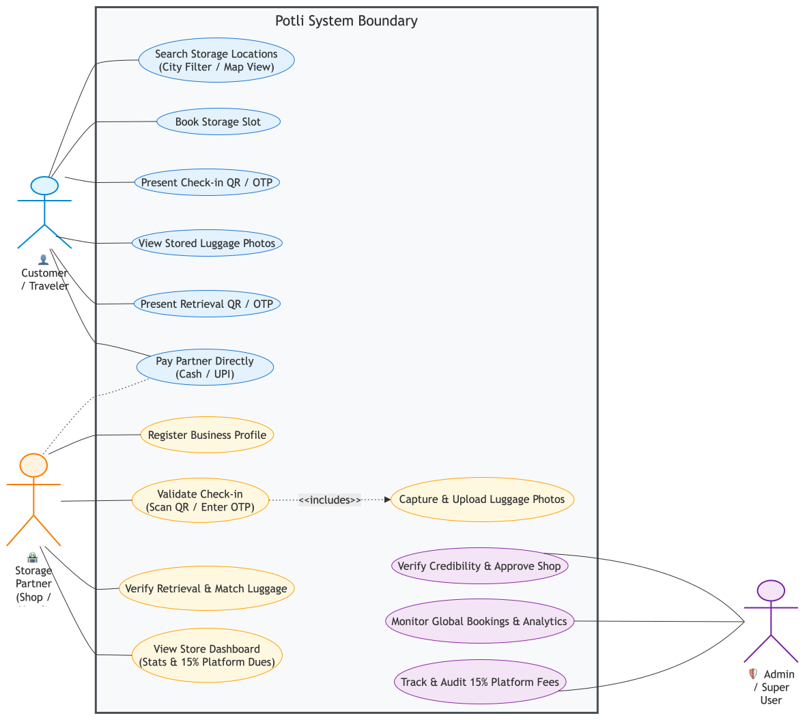
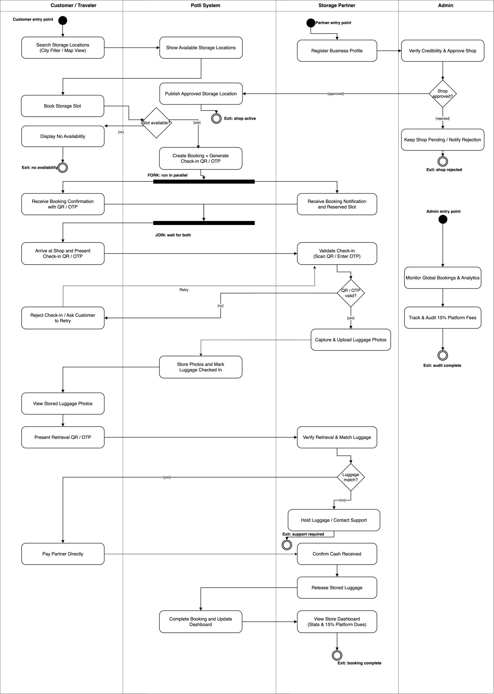
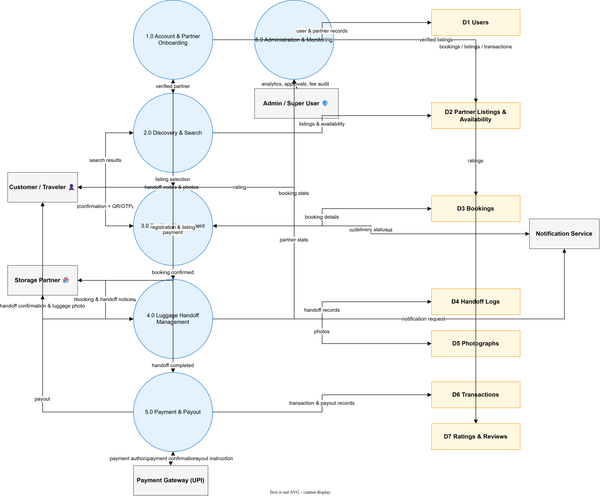
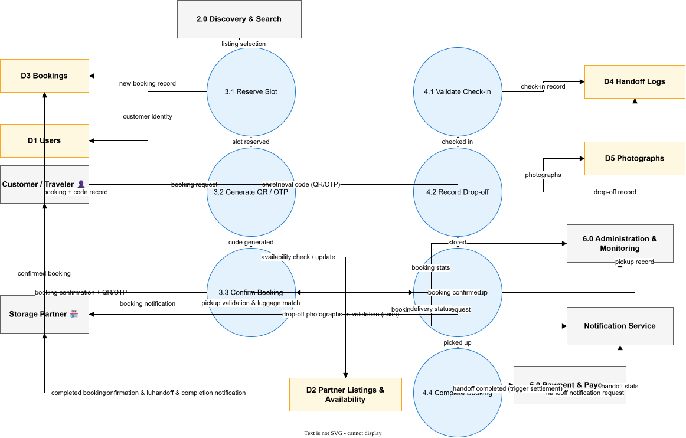
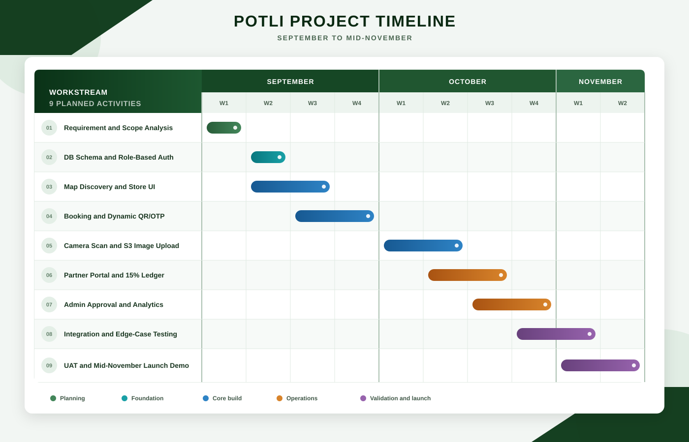

# POTLI

### On-demand luggage storage, powered by trusted local businesses

## Overview

**POTLI** is a web-based luggage storage network that connects travelers who need a safe place to leave their bags with verified shops, hotels, and other local businesses that have spare storage capacity.

Travelers can discover nearby storage, reserve a time slot, and use a QR code or OTP for a verifiable drop-off and pickup. Storage partners gain a simple way to manage bookings and earn from unused space, while platform administrators oversee partner verification, activity, and service quality.

The project focuses on a common gap in Indian cities, especially tier-2 and tier-3 cities, where dependable short-term luggage storage is often limited to a small number of railway stations and airports.

## The problem

Travelers between hotel check-in times, transport connections, meetings, or day trips often have no convenient way to store luggage for a few hours. Existing options can be difficult to find, unavailable, or hard to trust. At the same time, local businesses frequently have unused space but no structured way to offer it safely.

POTLI provides the coordination and trust layer between these two groups:

- **Discoverability:** find nearby storage partners, prices, hours, and availability.
- **Reliable handoffs:** track each bag through QR/OTP-verified check-in and retrieval.
- **Trust and accountability:** verify partners and retain photographic handoff records.
- **Local income:** allow businesses to earn from otherwise unused storage space.

## How it works

1. A traveler searches for available storage near a location.
2. They select a partner, choose a time window, and confirm the booking.
3. POTLI creates a booking ID with a QR code or OTP.
4. The partner verifies the code and records the luggage at drop-off.
5. The traveler returns and presents the retrieval code.
6. The partner matches the luggage, confirms pickup, and completes the booking.

## Core capabilities

| Traveler | Storage partner | Administrator |
| --- | --- | --- |
| Search by city or map | Register a business and storage listing | Verify and approve partners |
| Compare locations and book a slot | Set capacity, pricing, and hours | Monitor bookings and platform activity |
| Check in and retrieve with QR/OTP | Validate drop-off and pickup | Review utilization and revenue metrics |
| View stored-luggage confirmation | Capture handoff photographs | Audit platform fees and service quality |
| Rate the experience | Track bookings and earnings | Handle flagged listings and disputes |

## Use-case diagram

The diagram below shows the planned interactions between travelers, storage partners, administrators, and the POTLI platform.

  

## Activity diagram

The activity diagram details the end-to-end storage workflow, including partner approval, booking, QR/OTP check-in, luggage verification, pickup, and booking completion.

  

## Data flow diagrams

The data flow diagrams model the designed system from context (Level 0) through system decomposition (Level 1) to the detailed booking and handoff workflow (Level 2), with numbered processes, named data flows, and consistent data stores. All three are Mermaid sources rendered to SVG/PNG. See [Data Flow Diagrams](docs/data-flow-diagrams.md) for the explanation and data dictionary.

  

  

  

## Solution architecture

POTLI is planned as a responsive three-tier web application:

- **Frontend:** traveler discovery and booking, partner operations, and administration interfaces.
- **Backend API:** authentication, geo-based search, booking state transitions, handoff verification, payments, and payouts.
- **Data layer:** users, partner listings, availability, bookings, handoff logs, photographs, ratings, and transactions.

The design prioritizes low-friction onboarding, reliable use on low-to-mid-range devices, stateless APIs, indexed location search, and deployment through common managed web infrastructure.

## Project timeline

Development is organized around incremental delivery: establish the booking and handoff workflow first, then add partner operations, administration, integration testing, and deployment.

  

## Success criteria

The primary evaluation metric is **Booking Fulfillment Time (BFT)**: the time from the start of a search until a partner confirms the booking. The pilot target is a median BFT of **three minutes or less**.

Supporting measures include:

- successful drop-off and pickup rate;
- weekly partner-capacity utilization;
- partner payout turnaround time;
- traveler satisfaction after pickup; and
- search and booking availability during business hours.

## Project status

POTLI is currently in the **planning and design phase**. The proposal, initial system scope, use cases, and development schedule are available in this repository. Implementation will proceed in iterative milestones, beginning with discovery, booking, role-based access, and QR/OTP handoffs.

## Documentation

- [Project proposal (PDF)](project-proposal/main.pdf)
- [Project proposal source (LaTeX)](project-proposal/main.tex)
- [Use-case diagram](assets/use-case-diagram.svg)
- [Activity diagram](assets/activity-diagram.svg)
- [Data flow diagrams](docs/data-flow-diagrams.md)
- [Gantt chart](assets/gantt-chart.svg)

## Team

| Member | Roll number |
| --- | --- |
| Satyam Tiwari | 1024030088 |
| Ishant Mehndiratta | 1024030525 |
| Anshaj | 1024030494 |
| Aayush Bindal | 1024030498 |

Department of Computer Science and Engineering, Thapar Institute of Engineering and Technology.

## License

This project is available under the [MIT License](LICENSE).
